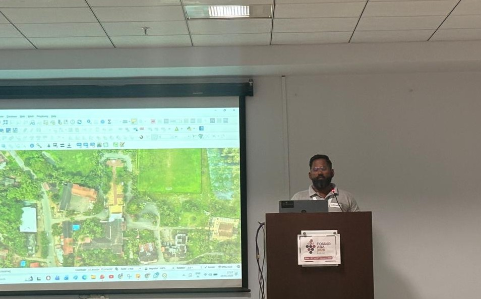

---
hide:
  - toc
  - navigation
---
<!--
CHECKLIST FOR THIS PAGE:
- [ ] Replace [YOUR NAME] with your full name (3 places)
- [ ] Replace [YOUR JOB TITLE] with your current or target role
- [ ] Replace [YOUR TAGLINE] with a short phrase describing your focus
- [ ] Rewrite the About Me paragraph with your own words
- [ ] Replace assets/images/profile.png with your actual photo (keep the filename or update it below)
- [ ] Replace assets/images/about.png with your own image (a field photo, map, or workspace shot)
- [ ] Edit the skill cards to match your actual skills (add, remove, or rename cards as needed)
- [ ] Update GitHub and LinkedIn links in the Connect section
- [ ] Add your CV PDF to docs/assets/ and update the filename in the Download CV button
-->

  
  <h1>Malcolm Afonso</h1>
  
<strong>Geospatial Consultant</strong>

  
<em>Simplifying Decision Making | GIS | Remote Sensing |Drone Mapping</em>

---

## About Me

 I work with real estate developers, land investors, architects, and government decision-makers who cannot afford ambiguity—because unclear or outdated land information inevitably shows up as approval delays, boundary disputes, redesigns, capital loss, and reputational risk.

I am the Founder of Spatialcraft, where we help stakeholders replace assumptions with verified ground truth at the very first step of a project—before designs are frozen, approvals are sought, or capital is committed.

My approach integrates high-resolution aerial surveys, physically validated DGPS/GNSS ground data, and advanced spatial analysis into smart, reliable outputs—delivered in CAD-ready formats and through our award-winning Smart Interactive Digital Maps (SIDM™) platform, a system for spatial decision-making.

Architects design on it.
Developers plan on it.
Investors trust it.
Authorities review it.

Over the years, I’ve worked on land due diligence, project site feasibility studies, construction progress monitoring, village-level geospatial mapping, statewide GIS portal development, wetland assessments, and digital planning initiatives across Goa. I have also led citizen-science efforts for village-level water resource mapping and planning.

My goal is simple: bring clarity, precision, and transparency to land and infrastructure decision-making—simplifying complexity through a “one map, all answers” approach.

If you’re planning a project, evaluating land, or exploring geospatial solutions, I’m happy to help you understand what’s possible.

  

---

[View My Projects :material-arrow-right:](projects/index.md){ .md-button .md-button--primary }
[Download CV :material-download:](assets/Malcolm-CV.pdf){ .md-button }

---

## Skills

-   :material-layers:{ .lg .middle } **GIS & Remote Sensing**

    ---

    - QGIS, Google Earth Engine
    - Multispectral image analysis
    - Cloud Native Geospatial (COG, STAC, Zarr)

-   :material-code-braces:{ .lg .middle } **Programming**

    ---

    - Python — GeoPandas, NumPy, Pandas, Matplotlib
    - JavaScript — Leaflet, openlayers
    - SQL, PostgreSQL + PostGIS

-   :material-star-four-points:{ .lg .middle } **Machine Learning & GeoAI**

    ---

    - Supervised classification — Random Forest, XGBoost, SVM
    - Deep learning for image segmentation — U-Net, SAM
    - scikit-learn, PyTorch, TensorFlow
    - Object detection in satellite imagery

-   :material-earth:{ .lg .middle } **Web Mapping & Data**

    ---

    - Cloud storage — AWS S3, Google Cloud Storage
    - Data formats — GeoTIFF, GeoParquet, NetCDF
    - Streamlit for data-driven web apps

-   :material-database:{ .lg .middle } **Data & Cloud**

    ---

    - PostgreSQL + PostGIS
    - Cloud storage: AWS S3, Google Cloud Storage
    - Data formats: GeoJSON, GeoTIFF, NetCDF, Zarr, GeoParquet

-   :material-airplane:{ .lg .middle } **Drone / UAV Data Processing**

    - Mission planning and flight operations
    - Photogrammetry: PIX4D Mapper, OpenDroneMap
    - Point cloud processing: CloudCompare, PDAL

---

## Connect

[GitHub](https://github.com/[YOUR-GITHUB-USERNAME]){ .md-button }
[LinkedIn](https://linkedin.com/in/[YOUR-LINKEDIN-USERNAME]){ .md-button }
